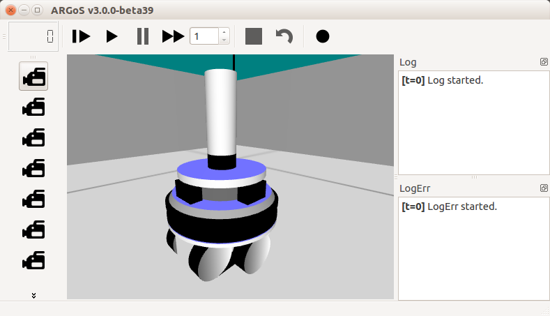
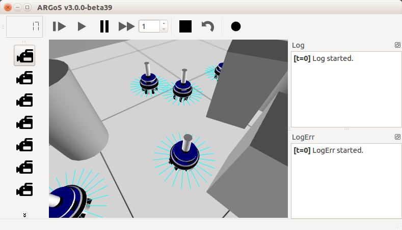
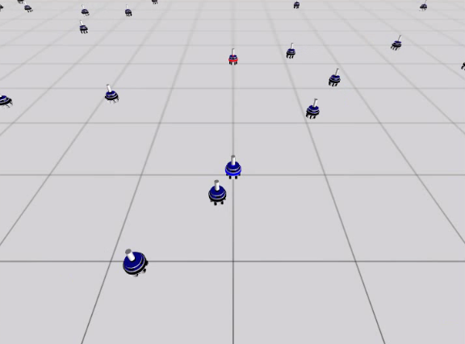
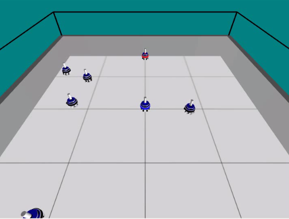
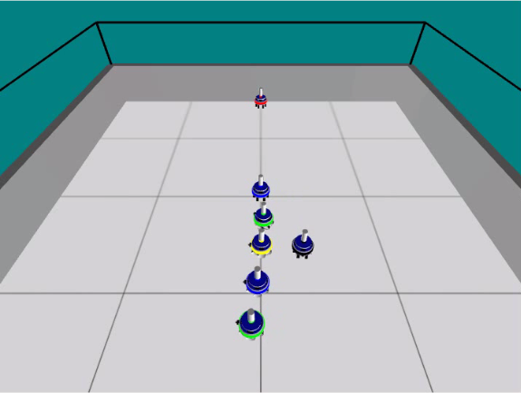
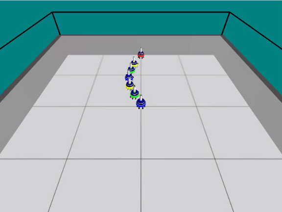
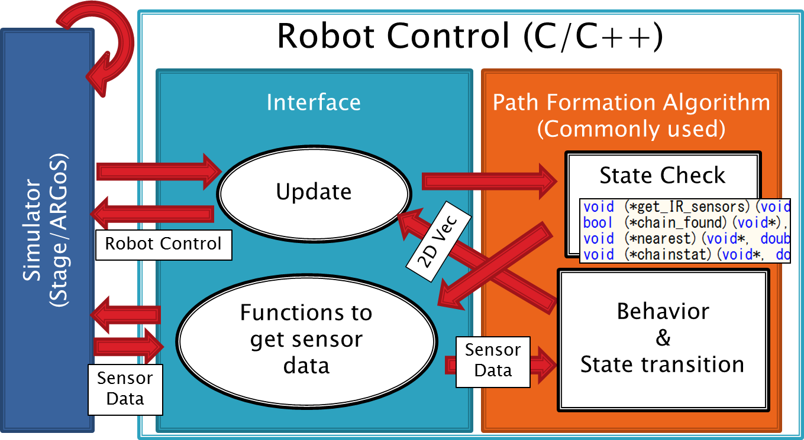

# Swarming of Multiple Robots on ARGoS simulator

This contains code to simulate swarming of multiple robots, which runs on [ARGoS simulator](https://github.com/ilpincy/argos3). The program was implemented by adding code to the rrepository [argos3-examples](https://github.com/ilpincy/argos3-examples). A swarm of robots forms a path from the starting point to the destination in an unknown environment. The program is based on the algorithm proposed by Nouyan et al. ([Path formation in a robot swarm](https://link.springer.com/article/10.1007/s11721-007-0009-6)).

  

## Simulator
To run this code, install ARGoS simulator.
For dependencies, refer to the instruction page of the simulator.
```
sudo apt-get install libfreeimage-dev libfreeimageplus-dev \
  qt5-default freeglut3-dev libxi-dev libxmu-dev liblua5.2-dev \
  lua5.2 doxygen graphviz graphviz-dev asciidoc
```
It may be better to compile the source code than to use the installation package.
```
git clone git@github.com:ilpincy/argos3.git
cd argos3
mkdir build_simulator
cd build_simulator
cmake ../src
make
make doc
sudo make install
```
in .bashrc
```
export LD_LIBRARY_PATH=$LD_LIBRARYPATH:/usr/local/lib/argos3
```
On the terminal,
```
. .bashrc
```

## Installation
Maybe, it is necessary to install them manually.
```
sudo apt-get install libga-dev
sudo apt-get install libgsl-dev
```
In the directory,
```
mkdir build
cd build
cmake -DCMAKE_BUILD_TYPE=Debug ..
make
```

## To Run It
In the directory,
```
argos3 -c experiments/<argos file>
```
For example,
```
argos3 -c experiments/pathformdemo_05.argos 
```

This will run a simulation with 5 walking robots (with the start and goal robots).

  

## What I added to the existing repository?
- controllers/footbot_path_formation
- new argos files in the exepriments directory


## System Diagram


___________________________________________________________________
___________________________________________________________________
The following below is the original README of ARGoS.
___________________________________________________________________
___________________________________________________________________
```
====================
==                ==
== ARGoS EXAMPLES ==
==                ==
====================

AUTHOR: Carlo Pinciroli <ilpincy@gmail.com>
DATE: 22/03/2015


*** INTRODUCTION ***

In this package you'll find some basic examples to start using ARGoS.

To run an experiment with ARGoS, you need to define two things:
1. the robot controllers
2. the experiment configuration

You find example controllers in the controllers/ directory. The
experiment configuration files are located in the experiments/
directory.

Currently, ARGoS supports the foot-bot (a.k.a. the marXbot), and the
e-puck. More robots will come in the future. All the examples, for the
time being, are implemented for the foot-bot.


*** THE EXAMPLES ***

DIFFUSION

In this example experiment, a foot-bot performs obstacle avoidance
while navigating in an small square environment.
The source files in controllers/footbot_diffusion/ contain all the
basic information about how to write a robot controller. Follow the
comments and you should grasp the first steps. The configuration files
for this experiment are two: experiments/diffusion_1.argos and
experiments/diffusion_10.argos. The first file places a single
foot-bot in an obstacle-free environment. In this file all the basics
about ARGoS configuration are covered. The second file is to see 10
robots in action. This files shows how to distribute objects (robots
and obstacles) randomly in the environment without having to place
them manually.

SYNCHRONIZATION

This example experiment reproduces the coupled oscillators of Mirollo
and Strogatz. In the beginning, the robots flash their LEDs out of
sync, but over time, seeing each other's LEDs, they synchronize.  In
this example you'll see how to use the camera, and how to distribute
robots in a grid.

FLOCKING

This example experiment shows how to achieve foraging through the well
known Lennard-Jones potential.  The robots light up their central LED
(called the beacon) in red. They use the omnidirectional camera to
detect robots around and calculate the Lennard-Jones interaction force
to all of them. The robots collectively go to a light source located
in the origin.

GRIPPING

This examples shows how to use a cylinder as a movable object. Using a
simple time-based logic, a foot-bot moves towards the cylinder, grips
it, moves backwards dragging it, and finally releases it while keeping
the backwards motion.

FORAGING

This example is a complete experiment. It shows how to interact with
the simulation through the loop functions and the how to draw on the
OpenGL graphical visualization through the Qt user functions. The
arena is divided in two areas: a grey area that serves as nest, where
the robots are initially deployed; and a white area where food items
are scattered. The task of the foot-bots is to exit the nest, search
for food items, grab them and bring them back to the nest. To simplify
control, food items are just drawn as black spots on the ground, and
when a robot passes over a food item it automatically grabs it. When a
robot is transporting a food item, a cylinder is drawn on top of
it. Each robot can transport only one item per time. Once a robot has
grabbed an item, it must bring it back to the nest. The direction
to/away from the nest is detectable through light sensors, that read
the position of a set of lights displaced over the nest.

EVOLUTION

This example shows how to embed ARGoS into a genetic algorithm and how
to evolve a simple neural network controller. In this example, a
foot-bot is evolved to perform phototaxis. The example is composed of
a neural network controller in the controllers/ directory, a loop
function in the loop_functions/ directory and additional code in the
embedding/galib directory to wrap ARGoS.  The code is compiled only if
the GALIB library is found. The library is searched for in /usr or
/usr/local. If you installed the library in a different place, use the
'ccmake' command to set the correct path. You can download GALIB at
http://lancet.mit.edu/ga/ or install it through your system's package
manager. On Ubuntu type 'sudo apt-get install libga-dev', while on
HomeBrew type 'brew install homebrew/science/galib'.


*** COMPILATION ***

In principle, you can compile your code however you want. In practice,
the help of a build system makes your work much easier. In ARGoS, and
in these examples, we use CMake. To compile the examples, open up a
shell, go to the directory where you unpacked the tar.bz2 file and
type:

$ mkdir build
$ cd build

To produce debuggable code (slow), type:

$ cmake -DCMAKE_BUILD_TYPE=Debug ..

To produce fast but not debuggable code, type:

$ cmake -DCMAKE_BUILD_TYPE=Release ..

Finally, launch the compilation with the command:

$ make

If you find no error, you're ready to go to the next phase.


*** TROUBLESHOOTING ***

When you launch one of the two 'cmake' commands, you might get an
error like 'package argos3_simulator' not found. This error has two
possible causes:

1. You haven't installed ARGoS3 system-wide. To fix this, install
   ARGoS3 through the packages or with the command 'sudo make install'
   in the ARGoS3 build directory.

2. pkg-config can't find the file argos3_simulator.pc. When you
   install ARGoS3 from a package, this file is located in
   /usr/lib/pkgconfig/. When you install ARGoS3 from the sources, this
   file is located in $CMAKE_INSTALL_PREFIX/lib/pkgconfig/. If you
   don't set $CMAKE_INSTALL_PREFIX explicitly before compiling, by
   default it is set to /usr/local.  If the file is present and
   pkg-config can't find it, add the directory where it's located to
   the environment variable PKG_CONFIG_PATH, e.g.

$ export PKG_CONFIG_PATH=/usr/local/lib/pkgconfig/


*** RUNNING THE EXAMPLES ***

To run an example, the configuration files have been written with the
hypothesis that you run them in the directory where you unpacked the
tar.bz2, NOT in the build/ directory. Therefore, go to that directory
and type:

$ argos3 -c experiments/diffusion_1.argos

for the example obstacle avoidance with a single robot, 

$ argos3 -c experiments/diffusion_10.argos

for the example obstacle avoidance with 10 robots,

$ argos3 -c experiments/synchronization.argos

for the synchronization experiment,

$ argos3 -c experiments/flocking.argos

for the flocking experiment, and

$ argos3 -c experiments/foraging.argos

for the foraging experiment.
The evolution experiments are divided in two parts. The
command

$ build/embedding/galib/galib_phototaxis

runs the evolution process with the GALib library. Then, the command

$ argos3 -c experiments/galib-trial.argos

allows one to test a specific neural network.

The command

$ build/embedding/mpga/mpga_phototaxis

runs the multi-process genetic algorithm. Then, the command

$ argos3 -c experiments/mpga-trial.argos

allows one to test a specific neural network.


*** WHAT'S NEXT? ***

More examples and a complete manual. I'm in the process of writing it,
I do it a little bit every day. If you have specific questions, you
can contact me at <ilpincy@gmail.com>.
```
